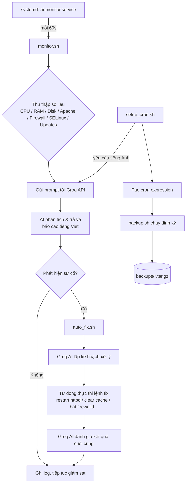

<div align="center">

# 🛡️ AI-Powered Linux Monitoring & Self-Healing System

### Hệ thống giám sát & tự phục hồi Linux ứng dụng AI


</div>
---

## 📂 Cấu trúc thư mục

```
Project_lab_Group5/
├── README.md                  # Tài liệu mô tả dự án (file này)
├── config.sh                  # Cấu hình chung: API key, model, đường dẫn
├── ask_ai.sh                  # Hàm dùng chung gọi Groq API
├── monitor.sh                 # Giám sát hệ thống + gọi AI phân tích (Topic 14)
├── auto_fix.sh                # AI lập kế hoạch & tự sửa lỗi (Topic 17)
├── setup_cron.sh              # Lên lịch bằng ngôn ngữ tự nhiên (Topic 06)
├── backup.sh                  # Script sao lưu dữ liệu định kỳ
├── install_service.sh         # Cài đặt monitor.sh thành systemd service
├── ai-monitor.service         # Template unit file cho systemd
└── file_check/
    └── check_api.txt          # Lệnh curl kiểm tra nhanh Groq API key
```

---
## 🏗️ Kiến trúc hệ thống



## 🧩 Các thành phần chính

<details>
<summary><strong>⚙️ config.sh</strong> — Cấu hình trung tâm</summary>

- Đọc `GROQ_API_KEY` ưu tiên từ biến môi trường (`~/.bashrc`); nếu không có (trường hợp chạy qua `systemd`) thì đọc từ `~/ai_monitor/groq.env`.
- Khai báo các biến dùng chung: `AI_MODEL` (`llama-3.3-70b-versatile`), `AI_ENDPOINT`, `PROJECT_DIR`, `LOG_FILE`, `BACKUP_DIR`, `DATA_DIR`.
</details>

<details>
<summary><strong>🤖 ask_ai.sh</strong> — Cầu nối tới Groq API</summary>

- Hàm `ask_ai()` dùng chung cho toàn bộ project, gọi endpoint OpenAI-compatible của Groq.
- Escape prompt an toàn bằng Python (tránh lỗi JSON), tự kiểm tra và báo lỗi nếu API trả về `error`.
</details>

<details>
<summary><strong>📊 monitor.sh</strong> — Giám sát hệ thống (Topic 14)</summary>

Thu thập và hiển thị 3 nhóm thông tin:

- **Hiệu năng**: CPU, RAM, Disk `/`, Load Average, trạng thái Apache httpd.
- **Bảo mật**: số lần đăng nhập thất bại (`lastb`), trạng thái `firewalld`, `SELinux`.
- **Cập nhật**: số gói cần update (`dnf check-update`).

Sau khi thu thập, gửi toàn bộ dữ liệu cho Groq AI để nhận báo cáo gồm: trạng thái tổng thể, phân tích hiệu năng/bảo mật/cập nhật và khuyến nghị. Nếu phát hiện sự cố, tự động gọi `auto_fix.sh`.
</details>

<details>
<summary><strong>🛠️ auto_fix.sh</strong> — Tự động sửa lỗi (Topic 17)</summary>

Quy trình 3 bước:

1. **Hỏi AI** cách xử lý từng vấn đề (Apache down, RAM/Disk cao, firewall tắt, CPU cao, đăng nhập sai, cần update).
2. **Tự động thực thi** lệnh khắc phục tương ứng và kiểm chứng lại trạng thái sau khi fix.
3. **Gửi kết quả cho AI đánh giá** lần cuối: tỉ lệ xử lý thành công, trạng thái từng lỗi, khuyến nghị tiếp theo.
</details>

<details>
<summary><strong>🗓️ setup_cron.sh</strong> — Lên lịch bằng ngôn ngữ tự nhiên (Topic 06)</summary>

- Người dùng nhập yêu cầu tiếng Anh (vd: `Run backup.sh every day at 2 AM`).
- Groq AI chuyển thành cron expression chuẩn 5 trường + giải thích bằng tiếng Việt.
- Hiển thị bảng phân tích cron, xác nhận trước khi ghi vào `crontab`.
</details>

<details>
<summary><strong>💾 backup.sh</strong> — Sao lưu dữ liệu</summary>

- Nén thư mục `data/` thành `backup_YYYYMMDD_HHMMSS.tar.gz` trong `backups/`.
- Tự động giữ lại tối đa 7 bản sao lưu gần nhất, xoá bản cũ hơn.
</details>

<details>
<summary><strong>🚀 install_service.sh & ai-monitor.service</strong> — Chạy nền với systemd</summary>

- Lưu `GROQ_API_KEY` ra `~/ai_monitor/groq.env` (vì systemd không đọc được `.bashrc`).
- Sinh file service từ template, cấu hình `sudo NOPASSWD` cho đúng các lệnh self-healing cần dùng.
- `enable` + `start` service để `monitor.sh` chạy lặp vô hạn, kiểm tra mỗi 60 giây (`Restart=always`).
</details>

---

## 🔧 Cơ chế tự sửa lỗi (self-healing)

| Sự cố phát hiện | Hành động tự động |
|---|---|
| `APACHE_DOWN` | `systemctl restart httpd` (fallback `start` nếu restart thất bại) |
| `MEM_HIGH` | `sync` + `sysctl -w vm.drop_caches=3` |
| `DISK_HIGH` | Xoá log `.gz` > 7 ngày, file tạm > 3 ngày, `journalctl --vacuum-time=7d`, `dnf clean all` |
| `FIREWALL_OFF` | `systemctl start firewalld && systemctl enable firewalld` |
| `CPU_HIGH` | Chỉ liệt kê top 5 tiến trình ngốn CPU (không tự kill) |
| `FAILED_LOGIN` | Chỉ ghi log để admin xem lại (không tự chặn) |
| `UPDATES` | Chỉ khuyến nghị `dnf update -y` (không tự update để tránh rủi ro) |

---

## 💻 Yêu cầu hệ thống

- CentOS Stream 9 (hoặc bản RHEL tương đương) với `systemd`, `dnf`, `firewalld`.
- `bash`, `python3`, `curl` đã cài sẵn.
- Quyền `sudo` của user dùng để cài service.
- API key Groq miễn phí tại [console.groq.com/keys](https://console.groq.com/keys).

---

## 🚀 Hướng dẫn cài đặt

```bash
# 1. Clone repo vào thư mục chuẩn của project
git clone https://github.com/ngahduc/Project_lab_Group5.git ~/ai_monitor
cd ~/ai_monitor
chmod +x *.sh

# 2. Khai báo API key Groq
echo 'export GROQ_API_KEY="gsk_xxxxxxxxxxxxxxxx"' >> ~/.bashrc
source ~/.bashrc

# 3. (Tuỳ chọn) kiểm tra nhanh API key còn hoạt động
bash file_check/check_api.txt   # hoặc copy nội dung lệnh curl để chạy thử

# 4. Cài đặt chạy nền tự khởi động cùng máy
bash install_service.sh
```

## 📋 Quản lý service & log

```bash
sudo systemctl status ai-monitor      # xem trạng thái service
sudo systemctl stop ai-monitor        # dừng
sudo systemctl restart ai-monitor     # khởi động lại
sudo systemctl disable ai-monitor     # tắt tự khởi động cùng máy
journalctl -u ai-monitor -f           # xem log realtime (Ctrl+C để thoát)
tail -f /var/log/ai_monitor.log       # xem log chi tiết monitor/auto_fix/backup
```
